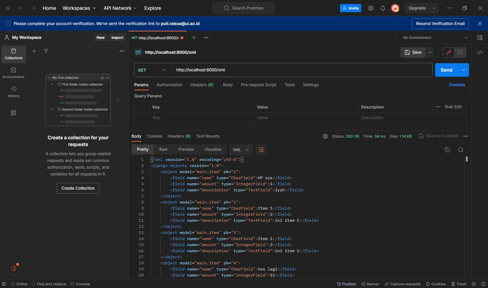

# Tugas Individu PBP

Proyek Django *Inventory* - __My Bag__

Puti Raissa - 2206830391 - PBP E

### Arsip tugas
<details>
<summary>Tugas 2</summary>

## Tugas 2
Untuk Tugas 2 PBP, saya membuat aplikasi *inventory* bertemakan sebuah tas. Aplikasi berjudul *My Bag* dapat dilihat pada [link ini](https://my-bag.adaptable.app/).

### Jelaskan bagaimana cara kamu mengimplementasikan checklist di atas secara step-by-step (bukan hanya sekadar mengikuti tutorial).

- Membuat sebuah proyek Django baru.

    Sebelum membuat proyek Django, ada beberapa hal yang perlu dipersiapkan terlebih dahulu. Pertama, saya membuat sebuah direktori baru, yang saya namakan `pbp-assignment`. Kemudian saya buat sebuah *virtual environment* dengam menjalankan perintah `python -m venv env` pada terminal dan mengaktifkannya dengan perintah `env\Scripts\activate.bat`.
    
    Lalu dalam direktori yang sama saya buat kumpulan *dependencies* dalam suatu *Text Document* . *Dependencies* tersebut yaitu

    ```
    django
    gunicorn
    whitenoise
    psycopg2-binary
    requests
    urllib3
    ```

    Kembali lagi ke terminal yang sudah diaktifkan *virtual environment*, saya jalankan perintah `pip install -r requirements.txt` untuk menginstall semua *dependencies*-nya. 
    
    Setelah itu baru saya membuat proyek Django dengan nama `pbp_assignment` dengan menjalankan perintah 

    ```
    django-admin startproject pbp_assignment .
    ```

    setelah perintah dijalankan, akan muncul direktori proyek dalam direktori utama serta berkas-berkas yang diperlukan proyek.

    Untuk memastikan proyek bekerja dengan baik, dijalankan server Django dengan perintah `python manage.py runserver` dan membuka http://localhost:8000, karena ada animasi roket maka aplikasi berhasil dibuat.

    Sebelum melanjutkan pembuatan aplikasi, saya menginisiasi direktori utama dan mengubahnya menjadi suatu repositori Git. Setelah itu, saya sambugkan repositori lokal ini dengan repositori baru pada GitHub.

- Membuat aplikasi dengan nama main pada proyek tersebut.

    Dalam direktori utama, saya buka terminal dan menjalankan virtual environment. Lalu saya jalankan perintah
    ```
    python manage.py startapp main
    ```

    akan muncul subdirektori baru dengan nama main berisi file-file yang diperlukan aplikasi. Setelah itu saya daftarkan aplikasi main dalam direktori proyek, dengan menambahkan `'main'` pada list `INSTALLED_APPS` di berkas settings.py.

    Kemudian saya buat subdirektori baru, yaitu templates, dalam direktori aplikasi main. Di dalam subdirektori tersebut saya buat sebuah berkas HTML bernama main.html yang akan digunakan nantinya.

- Melakukan routing pada proyek agar dapat menjalankan aplikasi main.

    Routing dilakukan dengan mengimpor fungsi include dan menambahkan rute URL pada list yang disediakan.
    ```
    from django.contrib import admin
    from django.urls import path, include

    urlpatterns = [
        path('admin/', admin.site.urls),
        path('', include('main.urls'))
    ]
    ```
    untuk melihat aplikasi, dapat dijalankan perintah  `python manage.py runserver` pada *virtual environment* dan membuka  http://localhost:8000

- Membuat model pada aplikasi main dengan nama Item dan memiliki atribut wajib sebagai berikut.
    - name sebagai nama item dengan tipe CharField.
    - amount sebagai jumlah item dengan tipe IntegerField.
    - description sebagai deskripsi item dengan tipe TextField.
    
    Pada direktori main terdapat berkas models.py. Dalam berkas tersebut saya tambahkan suatu model bernama `Item` dengan atribut yang diperlukan.
    ```
    class Item(models.Model):
    name = models.CharField(max_length=255)
    amount = models.IntegerField()
    description = models.TextField()
    ```
    setelah itu saya migrasi model ini untuk mengubah struktur tabel basis data dengan menjalankan perintah
    ```
    python manage.py makemigrations
    python manage.py migrate
    ```

- Membuat sebuah fungsi pada views.py untuk dikembalikan ke dalam sebuah template HTML yang menampilkan nama aplikasi serta nama dan kelas kamu.

    Pada views.py saya impor fungsi render untuk me-render file HTML serta menambahkan fungsi `show_main` sebagai berikut

    ```
    from django.shortcuts import render

    def show_main(request):
        context = {
            'nama_aplikasi': "My Bag",
            'nama': "Puti Raissa",
            'kelas': "PBP E"
        }

        return render(request, "main.html", context)
    ```
    Fungsi tersebut akan mengembalikan suatu *dictionary* ke template HTML sehingga key dari dictionary tersebut dapat bertindak menyerupai sebuah variabel dan dapat digunakan seperti demikian,
    ```
    <body>
        <h1>{{nama_aplikasi}}</h1>
        <h4>{{nama}}</h4>
        <h4>{{kelas}}</h4>
    </body>
    ```

- Membuat sebuah routing pada urls.py aplikasi main untuk memetakan fungsi yang telah dibuat pada views.py.
    
    Routing pada urls.py aplikasi main dijalankan dengan menulis kode berikut

    ```
    from django.urls import path
    from main.views import show_main

    app_name = 'main'

    urlpatterns = [
        path('', show_main, name='show_main'),
    ]
    ```

    fungsi `show_main` yang sudah diimpor dari views.py akan menjadi tampilan ketika URL diakses.

- Melakukan deployment ke Adaptable terhadap aplikasi yang sudah dibuat sehingga nantinya dapat diakses oleh teman-temanmu melalui Internet

    Setelah aplikasi jadi dilakukan deployment dengan cara memilih `NEW APP` dan menyambungkannya ke repositori yang ada pada GitHub.

    Pilih branch master, template *Python App Template*, *PostgreSQL*, lalu sesuaikan versi *python* menjadi 3.10 dan memasukkan *Start Command* `python manage.py migrate && gunicorn pbp_assignment.wsgi`

    Terakhir, centang bagian `HTTP Listener on PORT` dan *deploy app*. Aplikasi pun berhasil dideploy. :D

### Buatlah bagan yang berisi request client ke web aplikasi berbasis Django beserta responnya dan jelaskan pada bagan tersebut kaitan antara urls.py, views.py, models.py, dan berkas html.


Ketika *browser/user* melakukan *request* ke URL, dicek pada `urls.py` dan memanggil *view* yang sesuai dengan URL. *View* yang terletak pada `views.py` kemudian mengecek model yang sesuai dan diambil dari `models.py`. Lalu `views.py` mengembalikan data dari model ke *template* HTML. Data dimasukkan ke `main.html` dan setelah itu web dikembalikan sebagai respons untuk *browser/user*.

### Jelaskan mengapa kita menggunakan virtual environment? Apakah kita tetap dapat membuat aplikasi web berbasis Django tanpa menggunakan virtual environment?

*Virtual environment* digunakan untuk membentuk suatu lingkungan baru yang terpisah dan terisolasi untuk proyek python. Hal ini dilakukan untuk mengelola *dependencies*, menghindari konflik antar versi aplikasi, memastikan kompabilitas, dan menjaga lingkungan pengembangan aplikasi tetap teratur.

Pembuatan aplikasi Django tanpa menggunakan virtual environment masih memungkinkan tetapi tidak direkomendasikan. Karena adanya kemungkinan muncul masalah/error. 

### Jelaskan apakah itu MVC, MVT, MVVM dan perbedaan dari ketiganya

**MVC** (Model View Controller)

Aplikasi dipisah menjadi tiga komponen:

- Model

    Model mendefinisikan object ke dalam tabel database dan mengatur relasi antar object. 

- View

    View mengatur tampilan antarmuka pengguna dan cara data dari Model ditampilkan kepada pengguna.

- Controller

    Controller menjadi penghubung model dan view serta mengatur alur kontrol dalam aplikasi dan menangani permintaan dari pengguna.

**MVT** (Model View Template)

Aplikasi dipisah menjadi tiga komponen:

- Model

    Model bertanggung jawab untuk mengelola data dan melakukan operasi terhadap data tersebut. 

- View

    View mengatur logika dan alur program serta data yang dikirimkan oleh pengguna ke dalam database maupun dari database ke pengguna.

- Template

    Template menampilkan halaman website ke user yang diproses lewat browser.

**MVVM** (Model View ViewModel)

MVVM berfokus pada pemisahan antara kode untuk logika bisnis dan tampilan aplikasi. Aplikasi dipisah menjadi tiga komponen:

- Model

    Model mengelola data yang digunakan untuk logika bisnis. 

- View

    View mengatur tampilan aplikasi (UI). View hanya menampilkan data yang diberikan oleh ViewModel dan mengirimkan tindakan pengguna ke ViewModel

- ViewModel

    ViewModel menjadi perantara antara Model dan View. ViewModel mengambil data dari model dan diteruskan ke view.

Perbedaan utama terletak pada hubungan antara komponen. Pada MVC Controller bertindak sebagai penghubung antara Model dan View. Sementara itu, MVT adalah perkembangan dari MVC yang lebih erat menghubungkan Model dan View dan menggunakan Template untuk merender tampilan. Di sisi lain, MVVM memisahkan Model, View, dan ViewModel, dengan ViewModel berperan sebagai perantara antara Model dan View.
</details>


<details>
<summary>Tugas 3</summary>

## Tugas 3

### Apa perbedaan antara form POST dan form GET dalam Django?

Form POST dalam Django merupakan *method* HTTP yang mengembalikan *form login* Django. Secara sederhana, browser mengemas data dari *form*, mengenkripsinya untuk pengiriman, mengirimkannya ke server dan menerima responsnya kembali. Sebaliknya, form GET adalah suatu *method* HTTP yang mengemas data ke dalam sebuah *string*, dan menggunakannya untuk menyusun URL. URL tersebut berisi alamat tempat data harus dikirimkan, serta *keys* dan *value* data.

Perbedaan yang signifikan antara keduanya terdapat dalam keamanannya. 

|POST|GET|
|:---|:--|
|Nilai variabel tidak ditampilkan di URL|Nilai variabel ditampilkan di URL|
|Lebih Aman|Tidak seaman POST|
|Biasa digunakan untuk *request* yang membuat perubahan dalam basis data|Digunakan untuk *request* yang tidak memengaruhi sistem|

### Apa perbedaan utama antara XML, JSON, dan HTML dalam konteks pengiriman data?

__XML__ (Extensible Markup Language) adalah bahasa markup serbaguna yang dirancang terutama untuk menyimpan, mengirimkan, dan mengatur data. XML menawarkan fleksibilitas dengan menggunakan tag dan atribut yang dibuat user untuk merepresentasikan data. Dokumen XML terstruktur secara hierarkis, membentuk struktur dengan elemen yang bersarang. XML digunakan secara luas dalam skenario pertukaran data, file konfigurasi, dan merepresentasikan informasi terstruktur di berbagai domain.

__JSON__ (JavaScript Object Notation) merepresentasikan data dengan format sederhana yang mudah dibaca mesin dan manusia. Data disajikan dalam pasangan *key-value* di dalam suatu *array*. JSON banyak digunakan untuk mentransmisikan data antara server dan klien, terutama dalam aplikasi web. Secara keseluruhan, JSON lebih sederhana dan efisien.

__HTML__ (HyperText Markup Language) mempunyai tujuan yang sepenuhnya berbeda dibandingkan XML dan JSON. HTML fokus pada pembuatan dokumen terstruktur untuk web, seperti halaman web. Ini mendefinisikan tata letak, konten, dan visual halaman web, mencakup elemen seperti judul, paragraf, daftar, tautan, dan komponen multimedia. Dokumen HTML menggunakan elemen-elemen yang telah ditentukan sebelumnya yang dikelilingi oleh tag. Penggunaan utama HTML adalah dalam pengembangan web yang memungkinkan pembuatan *interface* web yang *user-friendly* dan interaktif.

### Mengapa JSON sering digunakan dalam pertukaran data antara aplikasi web modern?

JSON sering digunakan dalam pertukaran data antara aplikasi web modern karena lebih ringkas dan padat, sehingga lebih cepat dalam parsing dan generasi. Ini mengurangi ukuran dan bandwidth transfer data, serta meningkatkan kinerja dan efisiensi pemrosesan data. JSON juga mudah dibaca oleh manusia dan mesin, sehingga memudahkan pemeliharaan kode. JSON juga sangat kompatibel dengan aplikasi/teknologi web, sehingga mudah untuk mengembangkan serta mengintegrasikan aplikasi web dan API.

### Jelaskan bagaimana cara kamu mengimplementasikan checklist di atas secara step-by-step (bukan hanya sekadar mengikuti tutorial).

- Membuat input form untuk menambahkan objek model pada app sebelumnya.

    Dalam suatu file python baru, `forms.py`, import kelas ModelForm dari modul form yang disediakan Django serta model Item dari aplikasi main. Kemudian dibuat class ItemForm yang meng-inherit kelas ModelForm Django. Dengan class ini kita membuat form yang sesuai dengan model Item. Di dalam ItemForm ada class Meta. Di dalamnya kita menentukan model yang akan digunakan oleh form ini (Item) dan fields dari model yang akan ditampilkan dalam form (name, amount, description).

    ```
    from django.forms import ModelForm
    from main.models import Item

    class ItemForm(ModelForm):
        class Meta:
            model = Item
            fields = ["name", "amount", "description"]
    ```

    Selanjutnya dalam file `views.py` dibuat fungsi create_product,

    ```
    def create_product(request):
        form = ItemForm(request.POST or None)

        if form.is_valid() and request.method == "POST":
            form.save()
            return HttpResponseRedirect(reverse('main:show_main'))

        context = {'form': form}
        return render(request, "create_product.html", context)
    ```
    Fungsi ini menangani input baru dari form. Akan dibuat sebuah objek ItemForm berdasarkan data yang diterima dari `request.POST` (data yang dikirimkan melalui form). Kemudian, diperiksa apakah form tersebut valid dengan menggunakan `form.is_valid()`. Jika valid dan metode request adalah POST, data produk baru akan disimpan ke database melalui `form.save()`, dan pengguna akan diarahkan kembali ke halaman utama dengan HttpResponseRedirect.

    Kemudian di dalam file urls.py ditambahkan path URL yang mengarahkan permintaan ke create_product view saat pengguna ingin menambahkan produk baru.

    Setelah itu dibuat file HTML baru, `create_product.html`, yang akan menampilkan halaman form untuk menambah item baru. File ini mencakup form dengan token CSRF, bidang-bidang form, dan tombol "Add Item" yang mengirimkan data form ke view create_product.

    Terakhir pada file `main.html` ditambahkan potongan kode,
    ```
    
            <tr>
                <td>{{item.name}}</td>
                <td>{{item.amount}}</td>
                <td>{{item.description}}</td>
            </tr>
        
    ```
    untuk menampilkan data produk yang diterima dari view show_main dalam bentuk tabel, serta
    ```
    <a href="">
        <button>
            Add New Item
        </button>
    </a>
    ```
    sebagai tombol yang akan mengarahkan user pada halaman form penambahan item.


- Tambahkan 5 fungsi views untuk melihat objek yang sudah ditambahkan dalam format HTML, XML, JSON, XML by ID, dan JSON by ID.

    Berikut 5 fungsi views yang dibuat, 

    __Format HTML__

    ```
    def show_main(request):
        items = Item.objects.all()

        context = {
            'nama_aplikasi': "My Bag",
            'nama': "Puti Raissa",
            'kelas': "PBP E",
            'items': items
        }

        return render(request, "main.html", context)
    ```
    `items = Item.objects.all()` mengambil semua objek Item dari database dengan Item.objects.all() dan menyimpannya dalam variabel items. Data item kemudian disertakan dalam konteks dan akan ditampilkan dalam template HTML main.html.

    __Format XML__
    ```
    def show_xml(request):
        data = Item.objects.all()
        return HttpResponse(serializers.serialize("xml", data), content_type="application/xml")
    ```
    __Format JSON__
    ```
    def show_json(request):
        data = Item.objects.all()
        return HttpResponse(serializers.serialize("json", data), content_type="application/json")
    ```
    Kedua fungsi fungsi ini mengambil semua data dari model Item menggunakan `Item.objects.all()`. Selanjutnya, data tersebut diubah menjadi format XML/JSON menggunakan *serializer*. Akhirnya, respons HTTP yang berisi data sesuai format dikembalikan.
 
    __Format XML by ID__
    ```
    def show_xml_by_id(request, id):
        data = Item.objects.filter(pk=id)
        return HttpResponse(serializers.serialize("xml", data), content_type="application/xml")
    ```
    __Format JSON by ID__
    ```
    def show_json_by_id(request, id):
        data = Item.objects.filter(pk=id)
        return HttpResponse(serializers.serialize("json", data), content_type="application/json")
    ```
    Dua fungsi ini kurang-lebih sama dengan dua fungsi sebelumnya, hanya saja data dari model Item diambil dan difilter berdasarkan ID.

- Membuat routing URL untuk masing-masing views yang telah ditambahkan pada poin 2.

    Di dalam file urls.py yang terdapat di direktori main, diimpor kelima fungsi dan ditambahkan path url nya ke dalam list `urlpatterns` untuk dapat mengakses fungsi-fungsi tersebut. 
    ```
    ...
    path('create-product', create_product, name='create_product'),
    path('xml/', show_xml, name='show_xml'),
    path('json/', show_json, name='show_json'),
    path('xml/<int:id>/', show_xml_by_id, name='show_xml_by_id'),
    path('json/<int:id>/', show_json_by_id, name='show_json_by_id'),
    ... 
    ```
    Untuk melihat aplikasi, dapat dijalankan perintah `python manage.py runserver` pada *virtual environment* dan membuka http://localhost:8000/[format(xml, json, xml/[id], json/[id])]

### Mengakses kelima URL di poin 2 menggunakan Postman, membuat screenshot dari hasil akses URL pada Postman, dan menambahkannya ke dalam README.md.





</details>

<details>
<summary>Tugas 4</summary>

## Tugas 4

### Apa itu Django *UserCreationForm*, dan jelaskan apa kelebihan dan kekurangannya?

*UserCreationForm* dalam Django adalah model bawaan yang di*inherit* dari kelas ModelForm Django. *UserCreationForm* digunakan untuk membuat akun pengguna(*User*) baru dalam aplikasi web. *Form* ini memiliki tiga *fields* yang mencakup *username*, *password*1, dan *password*2 yang digunakan untuk validasi *password*.

Kelebihannya termasuk kenyamanannya, integrasi dengan model *User*, dan keamanan kata sandi bawaan. Kekurangannya melibatkan set bidang yang terbatas dan kurangnya verifikasi email bawaan, yang mungkin memerlukan penyesuaian tambahan atau solusi pihak ketiga untuk proses registrasi yang lebih aman.

### Apa perbedaan antara autentikasi dan otorisasi dalam konteks Django, dan mengapa keduanya penting?

Autentikasi adalah proses untuk memverifikasi identitas seorang pengguna. Ini melibatkan pemeriksaan kredensial yang diberikan oleh pengguna, seperti nama pengguna dan kata sandi. Dalam Django, hal ini ditangani oleh sistem autentikasi bawaannya. Ketika seorang pengguna masuk, kredensial mereka divalidasi, dan jika mereka cocok dengan entri dalam database pengguna, pengguna dianggap terautentikasi.

Sementara itu, otorisasi datang setelah autentikasi dan berurusan dengan apa yang pengguna yang sudah terautentikasi boleh lakukan dalam aplikasi. Ini menentukan izin, peran, atau grup yang menentukan akses dan tindakan pengguna dalam sistem. Sistem otorisasi Django dibangun di atas sistem autentikasinya dan memungkinkan *developer* untuk menentukan pengguna mana yang dapat melakukan tindakan tertentu atau mengakses sumber daya tertentu.

Kedua hal tersebut sangat penting untuk keamanan, pengendalian akses, *user experience*, dan kepatuhan dalam sebuah aplikasi Django. Mereka membantu memastikan fungsi yang tepat dan perlindungan sistem dan datanya.

### Apa itu cookies dalam konteks aplikasi web, dan bagaimana Django menggunakan cookies untuk mengelola data sesi pengguna?

Cookies adalah potongan data kecil yang dikirim oleh server web ke peramban web untuk disimpan dan digunakan di masa mendatang. Kemudian, cookies akan dikirim kembali oleh peramban web ke server untuk permintaan halaman di masa mendatang untuk menghemat bandwidth jaringan. Penggunaan umum cookies meliputi autentikasi, pelacakan pengguna, dan penyimpanan preferensi pengguna.

Dalam Django, cookies digunakan untuk mengelola data sesi pengguna dengan menyimpannya dalam database. Peramban mengirim permintaan ke server, server merespons dengan mengirimkan balasan, seringkali termasuk satu atau lebih cookie, ke peramban. Kemudian data akan diambil dan disimpan dalam model sesi oleh Django.
Setiap kali peramban membuat permintaan ke server, cookie tersebut akan secara otomatis disertakan dalam permintaan tersebut, memungkinkan server mengidentifikasi dan mengenali pengguna. Ketika cookie mencapai masa kadaluarsa, peramban akan menghapusnya dari penyimpanan lokal, dan cookie tersebut tidak akan lagi dikirim ke server dalam permintaan berikutnya.

### Apakah penggunaan cookies aman secara default dalam pengembangan web, atau apakah ada risiko potensial yang harus diwaspadai?

Meskipun cookie sering digunakan untuk fungsi situs web yang tidak berbahaya, mereka juga digunakan untuk aktivitas yang lebih kontroversial seperti melacak aktivitas pengguna dan menyimpan data pribadi pengguna. Cookies secara sendiri tidak membawa risiko keamanan, namun, mereka dapat digunakan oleh pelaku kejahatan cyber untuk menyamar sebagai pengguna, mengumpulkan data keuangan, mengakses akun mereka, atau mencuri kata sandi yang disimpan di peramban. Beberapa potensi resiko adalah Cross-Site Request Forgery (CSRF), serangan Cross-Site Scripting (XSS), Cookie Tossing, dan Cookie Overflow.

### Jelaskan bagaimana cara kamu mengimplementasikan checklist di atas secara step-by-step (bukan hanya sekadar mengikuti tutorial).

- Mengimplementasikan fungsi registrasi, login, dan logout untuk memungkinkan pengguna untuk mengakses aplikasi sebelumnya dengan lancar.

    Tambahkan fungsi register, login dan logout pada views.py

    ```
    def register(request):
        form = UserCreationForm()

        if request.method == "POST":
            form = UserCreationForm(request.POST)
            if form.is_valid():
                form.save()
                messages.success(request, 'Your account has been successfully   created!')
                return redirect('main:login')
        context = {'form':form}
        return render(request, 'register.html', context)
    ```
    Secara singkat, fungsi ini mengelola proses pendaftaran pengguna baru dalam sebuah aplikasi web Django. Pertama fungsi menampilkan formulir pendaftaran jika permintaan adalah tipe GET. Dan mengelola pengiriman data dari formulir jika permintaan adalah tipe POST. Fungsi akan memvalidasi data yang dimasukkan oleh pengguna, menyimpan informasi pengguna baru ke dalam database jika data valid, dan menampilkan pesan sukses jika pendaftaran berhasil. Terakhir, fungsi akan mengarahkan pengguna ke halaman login setelah pendaftaran berhasil.

    ```
    def login_user(request):
        if request.method == 'POST':
            username = request.POST.get('username')
            password = request.POST.get('password')
            user = authenticate(request, username=username, password=password)
            if user is not None:
                login(request, user)
                response = HttpResponseRedirect(reverse("main:show_main")) 
                response.set_cookie('last_login', str(datetime.datetime.now()))
                return response
            else:
                messages.info(request, 'Sorry, incorrect username or password. Please try again.')
        context = {}
        return render(request, 'login.html', context)
    ```
    Fungsi ini mengelola proses autentikasi dan login pengguna dalam aplikasi web Django. Jika pengguna mengirimkan data login melalui formulir POST dengan username dan password, fungsi ini memeriksa apakah kombinasi tersebut valid. Jika valid, pengguna dianggap telah login, sesi login dibuat, dan pengguna diarahkan ke halaman utama. Jika tidak valid, pesan kesalahan ditampilkan. Fungsi ini juga mengatur cookie 'last_login' untuk melacak waktu terakhir login pengguna.
    ```
    def logout_user(request):
        logout(request)
        response = HttpResponseRedirect(reverse('main:login'))
        response.delete_cookie('last_login')
        return response
    ```
    Saat dipanggil, fungsi ini mengakhiri sesi login pengguna dengan logout(request), kemudian mengarahkan pengguna kembali ke halaman login utama. Selain itu, cookie 'last_login' juga dihapus dari respons, sehingga pengguna tidak dapat melihat waktu terakhir mereka login setelah logout.

    Untuk tiap fungsi, dibuat template HTML-nya. Untuk fungsi register dan login, dibuat file baru. sementara tombol logout ditambahkan pada file `main.html`. Untuk masing-masing fungsi juga ditambahkan path url pada urlspattern di `urls.py`.

    ```
    urlpatterns = [
        ... 
        path('register/', register, name='register'),
        path('login/', login_user, name='login'),
        path('logout/', logout_user, name='logout'),
    ]
    ```

- Membuat dua akun pengguna dengan masing-masing tiga dummy data menggunakan model yang telah dibuat pada aplikasi sebelumnya untuk setiap akun di lokal.

    Mendaftarkan 2 akun pengguna dengan username dan password nya masing-masing. Kemudian login ke tiap akun dan menambahkan 3 dummy data dengan menekan tombol Add New Item dan memasukkan detail item.

- Menghubungkan model Item dengan User.

    Pertama dimodifikasi model Item, dengan ditambahkan *ForeignKey*, Ini akan menghubungkan setiap produk dengan pengguna yang membuatnya.

    ```
    class Product(models.Model):
        user = models.ForeignKey(User, on_delete=models.CASCADE)
        ...
    ```

    Kemudian, fungsi `create_product` dalam `views.py`, dimodifikasi sehingga item yang dibuat tidak disimpan langsung ke database dengan menggunakan `commit=False`. Kemudian, diisi kolom user produk dengan objek pengguna yang sedang login `(request.user)` sebelum menyimpan produk tersebut ke database.

    Pada fungsi `show_main` item difilter, yaitu hanya yang terasosiasi dengan pengguna yang sedang login. Ini akan memastikan bahwa pengguna hanya melihat produk yang mereka buat sendiri.

    Terakhir, diterapkan migrasi model sehingga database terbaharui.

- Menampilkan detail informasi pengguna yang sedang logged in seperti username dan menerapkan cookies seperti last login pada halaman utama aplikasi.

    *Context* pada `show_main` diubah seperti ini
    ```
    context = {
        'name': request.user.username,
        ...
    }
    ```
    Dengan kode ini kolom nama akan menunjukkan username pengguna yang sedang login.

    Ditambahkan juga kode berikut pada `main.html`
    ```
    ...
    <h5>Sesi terakhir login: {{ last_login }}</h5>
    ...
    ```    
    Dengan ini informasi *cookie* `last_login` pada *response* yang akan ditampilkan di halaman web.


    
</details>

## Tugas 5

### Jelaskan manfaat dari setiap element selector dan kapan waktu yang tepat untuk menggunakannya.

- Element selector

    Element selector menggunakan tag HTML sebagai selector untuk mengubah properti yang terdapat dalam tag tersebut. Setiap elemen yang memiliki tag HTML tersebut akan memiliki properti yang sama. 

    Selector ini bisa digunakan jika ingin menerapkan gaya secara umum ke suatu jenis elemen, misalnya, mengubah gaya teks untuk semua \<p> (paragraf) atau \<h1> (judul level 1) dalam dokumen.

    ```
    p {
        font-size: 16px;
        color: #eaea
    }
    ```

- ID Selector

    ID selector menggunakan atribut id dari elemen HTML untuk memilih elemen tertentu. Cara ini secara unik menargetkan satu elemen di dalam halaman HTML.

    Selector ini baik digunakan saat ada elemen tunggal dalam dokumen dengan ID unik dan akan diterapkan gaya khusus.

    Selector ditulis dengan tanda # diikuti dengan id elemen.

    ```
    #footer {
        text-align: center;
        color: #eaea;
    }
    ```

- Class Selector
    
    Class Selector memungkinkan kita untuk mengelompokkan elemen dengan karakteristik yang sama. Selector ini dapat digunakan untuk menetapkan gaya tambahan pada elemen yang sudah memiliki gaya dasar. Selector ini bisa digunakan ketika ingin menerapkan gaya pada beberapa elemen yang memiliki karakteristik atau fungsi yang sama.

    Selector Class ditulis dengan tanda . dan dikuti dengan class elemen.

    ```
    .center {
        text-align: center;
        color: #eaea;
    }
    ```

### Jelaskan HTML5 Tag yang kamu ketahui.

- \<header>\</header>

    Digunakan untuk mendefinisikan bagian header untuk elemen yang mengandungnya. Ini dapat digunakan sebagai header untuk seluruh halaman, tetapi juga dapat digunakan sebagai header untuk sebuah artikel atau konten halaman lainnya

- \<nav>\</nav>

    Elemen ini mengidentifikasi sebuah kelompok tautan navigasi. Tautan dalam elemen ini dapat mengarah ke halaman web lain atau ke bagian yang berbeda dari halaman web yang sama.

- \<footer>\</footer>

    Elemen ini adalah elemen struktural yang digunakan untuk mengidentifikasi footer dari sebuah halaman, dokumen, artikel, atau bagian. Sebuah footer umumnya berisi informasi hak cipta dan kepemilikan penulis atau elemen navigasi yang berkaitan dengan isi elemen induk.

### Jelaskan perbedaan antara margin dan padding.

Dalam model box CSS margin dapat didefinisikan sebagai ruang transparan di sekitar Border suatu elemen dan merupakan lapisan terluar dari model box. Sebaliknya, padding merupakan lapisan terdalam dalam model box CSS dan digunakan untuk merepresentasikan ruang transparan terdeket dengan elemen yaitu di sekitar konten suatu elemen.

### Jelaskan perbedaan antara framework CSS Tailwind dan Bootstrap. Kapan sebaiknya kita menggunakan Bootstrap daripada Tailwind, dan sebaliknya?

|Bootstrap|Tailwind|
|:---|:---|
|Menawarkan tema dan templat siap pakai.|Menawarkan kelas utilitas yang unik.|
|Menghasilkan tampilan serupa karena memiliki templat bawaan untuk situs web.|Hasil lebih unik dan fleksibel|
Lebih mudah untuk pemula|Perlu dipelajari lebih dalam

Gunakan Tailwind untuk desain yang unik dan sangat disesuaikan, kontrol yang sangat detail terhadap gaya, dan jika ingin membuat komponen dari awal. Gunakan Bootstrap jika mementingkan kecepatan, keahlian desain terbatas, atau jika ingin menggunakan komponen yang sudah jadi dan terstandarisasi untuk pengembangan cepat. Tailwind menawarkan fleksibilitas, sementara Bootstrap memberikan pendekatan terstruktur dengan komponen yang siap pakai.

### Jelaskan bagaimana cara kamu mengimplementasikan checklist di atas secara step-by-step (bukan hanya sekadar mengikuti tutorial).

- Kustomisasi halaman login, register, dan tambah inventori semenarik mungkin

    Saya memutuskan untuk menggunakan Bootstrap untuk tugas kali ini. 

    Pertama saya menambahkan Bootstrap ke aplikasi pada `base.html` di bagian tag \<head> beserta selector yang saya buat dalam tag \<style>.

    ```
    <link href="https://cdn.jsdelivr.net/npm/bootstrap@5.3.2/dist/css/bootstrap.min.css" rel="stylesheet" integrity="sha384-T3c6CoIi6uLrA9TneNEoa7RxnatzjcDSCmG1MXxSR1GAsXEV/Dwwykc2MPK8M2HN" crossorigin="anonymous">
    <script src="https://code.jquery.com/jquery-3.6.0.min.js" integrity="sha384-KyZXEAg3QhqLMpG8r+J4jsl5c9zdLKaUk5Ae5f5b1bw6AUn5f5v8FZJoMxm6f5cH1" crossorigin="anonymous"></script>
    <style>
        body {
            background-color: #E4E4F0;
        }

        #login {
            display: flex;
            align-items: center;
            justify-content: center;
            padding-top: 50px;
            padding-bottom: 50px;
            height: auto;
            background-color: #E4E4F0;
        }

        .login {
            width: 100%;
            max-width: 330px;
            padding: 20px;
            margin: 0 auto;
        }

        .register {
            width: 100%;
            padding: 20px;
            margin: 0 auto;
            max-width: 500px;
        }

        h1 {
            padding: 5px;
        }

        table, th, td {
            padding: 5px;
        }

        .footer {
            position: absolute;
            bottom: 0;
            width: 100%;
            height: 60px;
            line-height: 60px;
            background-color: #D4D4E7;
        }
    </style>
    ``` 

    Kemudian saya modifikasi file `login.html`, `register.html`, dan `create_product.html` menggunakan selector yang sudah dibuat, mengatur model box konten pada tiap file, serta mengubah beberapa elemen seperti button supaya lebih menarik dan seragam.

    `login.html`

    ```
    <div id="login">
        <div class = "login">
            <h1 class="text-center">Login</h1>
            ...

                <td></td>
                <td><input class="btn btn-outline-dark" type="submit" value="Login"></td>
            ...
    ```

    `register.html`

    ```
    <div id = "login">
        <div class="register">
            <h1 class="text-center">Register</h1>  
            ...
    ```

    `create_product.html`

    ```
    ...
    <td>
        <input type="submit" class="btn btn-light" value="Add Item"/> 
    </td>
    ...
    ```


- Kustomisasi halaman daftar inventori menjadi lebih berwarna maupun menggunakan apporach lain seperti menggunakan Card.

    Halaman daftar inventori di `main.html` dan file html lainnya saya berikan warna background yang seragam supaya lebih berwarna. Selain itu di halamam utama saya berikan navigation bar dan footer yang berisi beberapa informasi seperti nama aplikasi dan nama saya sendiri.

    Saya juga memindahkan tombol logout ke dalam navigation bar karena lebih bagus :).

    Navigation bar
    ```
    <nav class="navbar navbar-expand navbar-dark bg-secondary">
        <div class="container">
            <a class="navbar-brand mb-0 h1">MY BAG</a>
            <div class="collapse navbar-collapse">
                <div class="d-flex justify-content-end">
                    <form class="form.inline">
                        <a href="">
                            <button class="btn btn-light" type="button">Logout</button>
                        </a>
                    </form>
                </div>
            </div>
        </div>
    </nav>
    ```

    Footer
    ```
    <footer class="footer">
        <div class="container">
          <span class="text-muted">Puti Raissa - {{kelas}}</span>
        </div>
    </footer>
    ```

    Kemudian saya mengganti beberapa hal sepserti button dan tabel supaya lebih bagus.

    ```
    <table class="table table-bordered">
    ...
    <button class="btn btn-light">
    ```